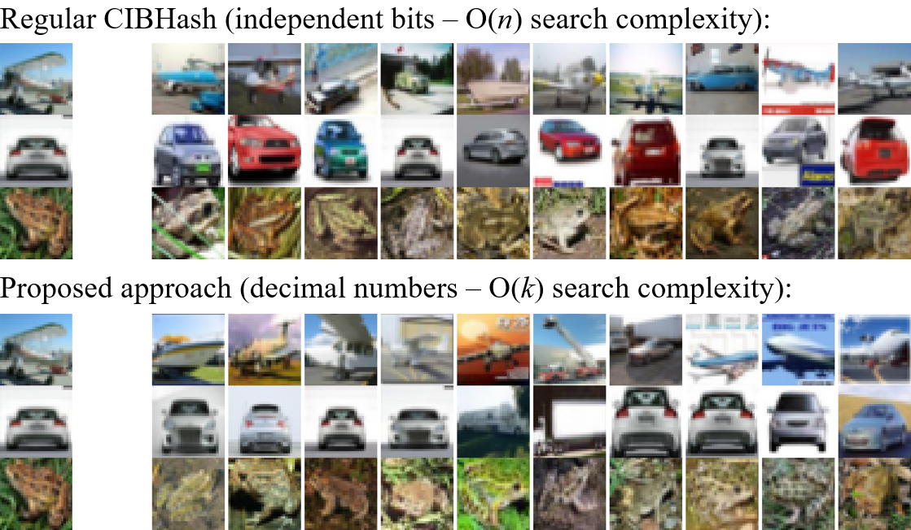
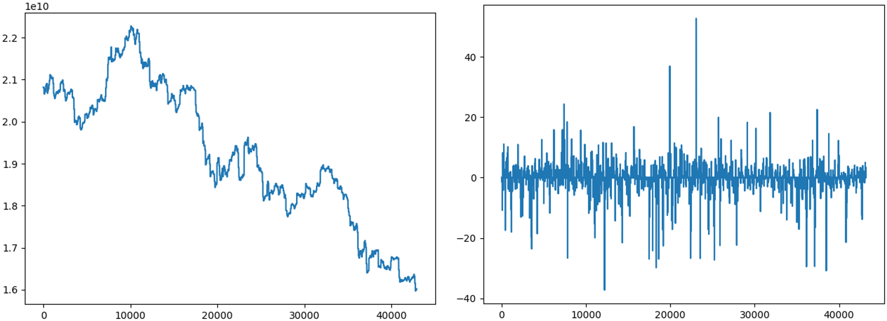

## Master's thesis: "Associative metamemory" in [English](masters/thesis_eng.pdf), in [Ukrainian](masters/thesis_ukr.pdf).

### The main figures:

We cannot completely prevent false results, but the approach works in O(k), meaning it is agnostic to database size:

### Contributions:
* https://github.com/swuxyj/DeepHash-pytorch/issues/43
* https://github.com/zexuanqiu/CIBHash/pull/4

## Bachelors's thesis: "Intellectual trading strategy using Reinforcement Learning" in [English](bachelors/thesis_eng.pdf), in [Ukrainian](bachelors/thesis_ukr.pdf).

### The main figures:

An example of fractional differentiation:

An example of automatically determined order or differentiation:

### Contributions:
* https://github.com/fracdiff/fracdiff/issues/27
